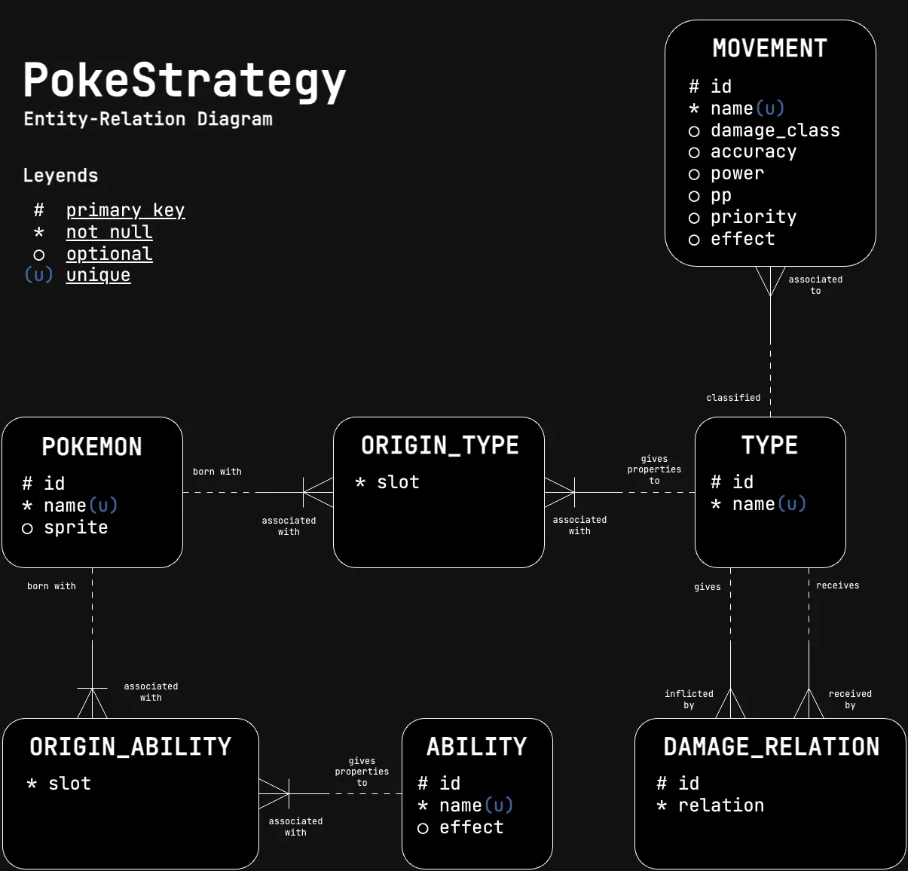

<div
  align="center"
  style="
    display: flex;
    flex-direction: column;
    justify-content: center;
    align-items: center;
    width: 100%
  "
>

  

  <a href="https://pokemonstrategy.netlify.app/">Ir a la app</a>

</div>

## Descripción

La aplicacion te permite buscar un pokemon por su nombre, al selecionarlo te mostrara su informacion básica (habilidades y tipos). Tambien, te mostrará de forma simple y en un solo lugar, los tipos contra los que es fuerte, debil y neutral.

## Motivación

Cuando estas jugando pokemon tranquilamente y te encuentras con un pokemon que no conoces, o simplemente quieres saber si tu pokemon es fuerte o debil contra otro, es necesario buscar en internet o en una app la informacion de los tipos de los pokemon y sus debilidades, lo cual no es muy eficiente ya que hace falta ver varias paginas a la vez para tener toda esta informacion (Ej. informacion de un pokemon en una pagina, y tabla de relaciones de daño en otra). Con esta app, puedes hacerlo de forma rapida y sencilla.

## Tecnologías utilizadas

  - Node.js (lts/hydrogen) (v18.20.4)
  - Vue.js (Vue 3, Composition API, TypeScript, Pinia, Axios, Zod, Tanstack Query)
  - Tailwind CSS, vue-shadcn
  - sqlocal, drizzle orm
  - eslint (reglas recomendadas de Vue.js y generales)
  - pnpm
  - Vite
  - Vitest
  - Cypress
  - Clean Architecture

## Como funciona

La aplicacion se conecta a la API de [PokeAPI](https://pokeapi.co/) para obtener la informacion de los pokemon. Esto solo se hace en la primera visita a la app, luego se utilizar sqlocal para crear una base de datos Sqlite en el navegador (especificamente en el OPFS -> Origin Private File System) y almacenar la informacion de los pokemon. De esta forma, la app es mucho mas rapida y no necesita hacer peticiones a la API cada vez que se busca un pokemon.

Esta base de datos de "cache" tiene la siguiente estructura:

<div
  align="center"
  style="
    display: flex;
    flex-direction: column;
    justify-content: center;
    align-items: center;
    width: 100%
  "
>

  

</div>

Esta base de datos se consulta por medio de drizzle orm, el cual es un ORM que se encarga de hacer las consultas a la base de datos y mapear los resultados a objetos de javascript.

## Estructura del proyecto

El proyecto separa las capas de la aplicacion siguiendo el patron de arquitectura limpia (Clean Architecture) junto con screaming architecture, separando todo lo que es del framework (Vue.js) y el resto usando modulos por caracteristica.

## Correr localmente el proyecto

1. Crear un archivo .env basado en el archivo `.env.example`

2. Instalar las dependencias del proyecto:

```bash
pnpm install
```
> **Nota:** En caso de no tener pnpm instalado, se puede instalar con el siguiente comando:
> ```bash
> npm install -g pnpm
> ```

3. Correr el proyecto:

```bash
pnpm dev
```

4. Acceder a la URL [http://localhost:5173](http://localhost:5173) en el navegador.

<!-- ## Correr las pruebas unitarias y de integracion

```bash
pnpm test
```
## Correr las pruebas end to end
> **Nota:** Configurar variables de entorno en archivo cypress.env.json basandose en el archivo `cypress.env.example.json`:
> de modo que el entorno de desarrollo de cypress pueda acceder a ellas correctamente.

Primero es necesario hacer build del proyecto:
```bash
pnpm build
```
Luego ejecutar el servidor de pruebas e2e:
```bash
pnpm test:e2e
```
Entrar por el navegador a la URL [http://localhost:4173](http://localhost:4173)

cuando ya se ejecute al app, abrir una nueva terminal en el proyecto y ejecutar el siguiente comando:
```bash
pnpm cypress run --e2e
```
Finalmente se puede ver el resultado de las pruebas en la terminal. -->

